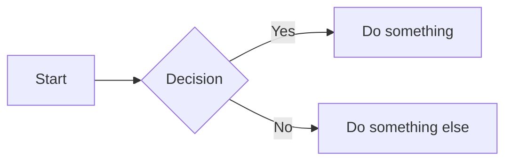

# Cirrus for Jekyll

A clean, minimal Jekyll template for a **CV + blog** site, designed to be deployed on **GitHub Pages in minutes** — no server, no build pipeline, no command line required.

All personal content is configured through YAML files — no template editing needed.

Built with Bootstrap 5, Font Awesome 6, Mermaid 11 and Poppins — **all self-hosted** (zero external CDN, full GDPR compatibility) and full GitHub Pages compatibility.

**Live demo:** [surlesnuages.fr](https://surlesnuages.fr)

## Table of contents

- [Features](#features)
- [Deploy to GitHub Pages](#deploy-to-github-pages-no-server-needed)
- [Configure your site](#configure-your-site)
- [Writing articles](#writing-articles)
  - [Front matter reference](#article-front-matter-reference)
  - [Images](#images-in-the-body)
  - [Smart links](#smart-links)
  - [Difficulty badges](#difficulty-badges)
  - [Recommended workflow with Obsidian](#recommended-workflow-with-obsidian--obsidian-git-plugin)
- [Article series](#article-series)
- [Translate the UI](#translate-the-ui)
- [Dark mode](#dark-mode)
- [Customize the look](#customize-the-look)
  - [Footer wave](#footer-wave)
  - [SCSS architecture](#scss-architecture)
- [Obsidian callouts](#obsidian-callouts)
- [Mermaid diagrams](#mermaid-diagrams)
- [Share buttons](#share-buttons)
- [Adding comments (optional)](#adding-comments-optional)
- [Broken link checker](#broken-link-checker)
- [GitHub Pages — authorized use](#github-pages--authorized-use)
- [Local development](#local-development)
- [License](#license)
- [Show some love](#show-some-love)

---

## Features

- **CV page** — skills, work experience, certifications, languages, interests
- **Blog** — article cards with search, tag cloud, chronological / tag / series views, RSS feed, pagination
- **Article series** — dedicated `/series/<slug>/` pages with ordered article list, SEO breadcrumbs, series block on every article
- **Fully data-driven** — all personal content lives in `_data/` YAML files
- **Dark mode** — automatic (follows OS preference) with manual toggle, persists in localStorage, safe in private browsing
- **Translatable** — all UI strings in `_data/ui.yml`, translate the entire site by editing one file
- **Print-friendly** — optimized CV layout for PDF export (always prints in light mode)
- **Accessible** — keyboard navigation, ARIA labels, skip link, screen-reader support, `prefers-reduced-motion`, focus-visible outlines, scrollable table regions
- **SEO** — Open Graph (with `article:modified_time` and `article:tag`), Twitter Card, JSON-LD structured data (Article, WebSite with SearchAction, BreadcrumbList, ItemList for series), sitemap
- **Customizable** — edit `custom.css` to change colors and fonts without touching the core stylesheet
- **Mermaid diagrams** — flowcharts, sequence diagrams, Gantt charts, auto-detected (no `mermaid: true` needed), synced with dark mode, with fullscreen pan/zoom modal
- **Obsidian callouts** — `> [!NOTE]`, `> [!WARNING]`, `> [!TIP]`, `> [!IMPORTANT]`, `> [!CAUTION]` rendered as styled callout blocks
- **Smart links** — bare URLs auto-linked, external links get a `target="_blank"` icon and sr-only "opens in a new window" text automatically
- **Social share bar** — LinkedIn, Bluesky, X, copy-link buttons on every article
- **Code blocks** — syntax highlighting with copy-to-clipboard button on hover
- **Table of contents** — auto-generated per article (inline + floating pill with drawer for long reads)
- **Collapsible sections** — H2 headings can be folded/expanded via Bootstrap collapse
- **Performance** — Bootstrap, Font Awesome, Mermaid and Poppins all self-hosted (zero external CDN), print CSS split into a separate `media="print"` stylesheet (never blocks first paint), preload hints for LCP banner, Sass compression, lazy loading, `fetchpriority="high"` on above-the-fold images, deferred non-critical JS, search index fetched only on focus
- **Privacy** — no third-party CDN for fonts, CSS or JS (GDPR-friendly), email obfuscation via data attributes, anti-crawler helper
- **Broken link checker** — GitHub Actions workflow runs weekly (and on every push) to detect dead links, opens a GitHub issue with the full report when something breaks
- **Keyboard shortcut** — press `/` anywhere to focus the search input
- **Difficulty badges** — optional article difficulty level shown as a weather-themed badge
- **Modular SCSS** — clean architecture under `_sass/` with a shared `badge-style` mixin

---

## Deploy to GitHub Pages (no server needed)

> Your site will be live at `https://your-username.github.io/your-repo/` within minutes.

### 1. Use this template

Click **"Use this template"** → **"Create a new repository"** on GitHub.

### 2. Enable GitHub Pages

In your new repo: **Settings → Pages → Source → Deploy from branch** → select `main` / `root` → **Save**.

That's it. GitHub builds and hosts your site automatically on every push. No Ruby, no terminal, no CI setup needed.

---

## Configure your site

### 3. Edit `_config.yml`

```yaml
title: My Site
home_title: "Welcome!"
home_tagline: "Discover my latest articles."
url: "https://your-username.github.io"
baseurl: "/your-repo"          # leave "" if the site is at the root domain
description: "Your site description for SEO."
lang: en                       # used for the HTML lang attribute
```

### 4. Fill in your personal info

Edit `_data/author.yml`:

```yaml
name: Jane Doe
role: Systems Administrator
linkedin: https://www.linkedin.com/in/your-profile/
github: https://github.com/your-username
email_user: your.email
email_domain: example.com
bio: >-
  Write your bio here...
```

> The email is **never** rendered as plain text in the HTML — parts are stored in `data-email-*` attributes and reassembled client-side by `shared.js`, making it unusable to scrapers.

### 5. Fill in your CV data

Edit the files in `_data/`:

| File | Content |
|---|---|
| `skills.yml` | Technical skills with levels |
| `experiences.yml` | Work experience (with or without sub-missions) |
| `certifications.yml` | Professional certifications + badge images |
| `applied_skills.yml` | Micro-certifications / applied skills |
| `education.yml` | Education & training |
| `languages.yml` | Language skills |

### 6. Add your profile photo

Replace `assets/photo.webp` with your own picture (recommended: square, ~300×300px).

### 7. Add flag images (optional)

If you fill in `_data/languages.yml`, add a flag image for each language in `assets/`. The file path must match what you set in the `flag:` field (e.g. `assets/flag-en.png`).

---

## Writing articles

You can write articles with any tool you like:

- **Directly on GitHub** — create a new file in `_posts/` via the GitHub web editor. The simplest option, no tools needed.
- **Any text editor + git** — write markdown files locally and push with git.
- **Obsidian** *(recommended)* — see the workflow below for a smooth writing experience.

### Article front matter reference

```yaml
---
layout: post
title: "Your article title"
date: 2025-01-15
last_modified_at: 2025-06-01    # optional — shows an "Updated:" date in the header
excerpt: "Short summary shown on cards and in search."
tags: [Azure, PowerShell]
image: /assets/my-image.png       # card thumbnail + article header
banner: /assets/my-banner.jpg     # full-width header (overrides image)
difficulty: beginner              # optional — beginner | intermediate | advanced | expert
series: "My Series Name"          # optional — group articles in a series
series_part: 1                    # optional — position in the series
# placeholder: true               # uncomment to show an "AI-generated" disclaimer
---
```

> **Heads-up — placeholder images.** Out of the box, the demo post and `default_image` use [loremflickr](https://loremflickr.com/) for cloud/sky thematic placeholders. Fresh installs show nice imagery with zero config. Replace them with your own assets in `_config.yml` and the demo post front matter whenever you're ready.

A ready-to-use template with all properties documented is available at `Templates/post-template.md`.

### Images in the body

```markdown
                  ← centered (default)
{: .img-left}     ← float left
{: .img-right}    ← float right
{: .img-full}     ← full width
```

To place two images side by side, use `.img-left` and `.img-right` on consecutive images:

```markdown
{: .img-left}
{: .img-right}
```

Click any image in an article to open it fullscreen.

### Smart links

Bare URLs in article content are automatically converted to clickable links. External links automatically get a `target="_blank"` attribute, a small icon, and screen-reader text ("(opens in a new window)") — no Markdown needed:

```markdown
Visit https://example.com for more info.
```

Renders as a clickable link with an external icon, without any extra syntax.

### Difficulty badges

Set `difficulty:` in front matter to display a weather-themed badge in the article header and on cards:

| Value | Icon | Label |
|---|---|---|
| `beginner` | ☀️ | Beginner |
| `intermediate` | ☁️ | Intermediate |
| `advanced` | 🌧️ | Advanced |
| `expert` | 🌪️ | Expert |

The displayed labels are translatable via `_data/ui.yml` (keys `diff_beginner`, `diff_intermediate`, `diff_advanced`, `diff_expert`). The front matter values stay as-is.

### Recommended workflow with Obsidian + Obsidian Git plugin

> Write in Obsidian, publish with two clicks — no terminal needed.

1. **Set up the template** — in Obsidian settings, go to **Templates → Template folder location** and set it to `Templates`. The file `Templates/post-template.md` will then be available as a template in Obsidian.

2. **Create a draft** — create a new note in the `_drafts/` folder. Open the command palette (`Ctrl+P`) → **Templates: Insert template** → select `post-template`. Fill in the front matter.

3. **Write your article** in Obsidian. Add images to `assets/`.

4. **When ready to publish** — rename the file to `YYYY-MM-DD-your-title.md` and move it to `_posts/`.

5. **Push to GitHub** — open the Obsidian Git panel (left sidebar) → **Stage all** → **Commit** → **Push**.

6. **Done** — GitHub Pages rebuilds your site automatically within ~1 minute.

---

## Article series

Group related articles into a series with an ordered list, a shared description, and a dedicated page at `/series/<slug>/`.

### 1. Create a series stub

Add a file in `_series/my-series.md`:

```yaml
---
series_name: "my-series"                # must match the `series:` field on posts
title: "Mastering Power Automate"       # displayed title (defaults to series_name)
description: "A 5-part series covering…" # optional — shown on the series page and cards
expected_count: 5                       # optional — enables "3/5 articles" progress counter
---
```

### 2. Tag your posts

On each post in the series, add:

```yaml
series: "my-series"
series_part: 1
```

The posts will then show:
- A **series block** at the bottom of each article, listing all parts with the current one highlighted
- A **4-level breadcrumb** in JSON-LD (Home > Articles > Series > Post)
- A card in the **"By series"** view on the `/articles/` page
- A dedicated **series page** at `/series/my-series/` listing all articles in order

### 3. Drafts (local only)

For series you haven't published yet, create the stub in `_series_drafts/` instead of `_series/`. Jekyll builds them locally with `--drafts` but they don't appear in production.

---

## Translate the UI

All user-facing strings are in **`_data/ui.yml`**. To translate the site to another language:

1. Set `lang: fr` (or your language code) in `_config.yml`
2. Edit `_data/ui.yml` and translate each value

No template files need to be changed.

---

## Dark mode

Dark mode works out of the box:
- **Automatic** — follows the OS/browser `prefers-color-scheme` setting
- **Manual toggle** — moon/sun icon in the navbar, persisted in `localStorage`
- **Private browsing safe** — `localStorage` access wrapped in `try/catch`
- **Print** — always uses the light theme

To customize dark mode colors, add overrides in `custom.css`:

```css
[data-theme="dark"] {
  --color-background: #your-dark-bg;
  --color-card-bg: #your-dark-card-bg;
  --color-text: #your-light-text;
}
```

---

## Customize the look

Edit **`custom.css`** at the root of the repo — all CSS variables are listed with comments, just uncomment the ones you want to change. This file is loaded after the main stylesheet so your values always win.

Available variables:

| Variable | Default | Description |
|---|---|---|
| `--color-primary` | `#081a34` | Navbar, headings, buttons |
| `--color-secondary` | `#003b82` | Links, borders, highlights |
| `--color-background` | `#eef2f3` | Page background |
| `--color-card-bg` | `#ffffff` | Card / section background |
| `--font-main` | `'Poppins', sans-serif` | Main font |
| `--border-radius` | `15px` | Card / button corner radius |

To use a different font, replace the files in `assets/fonts/` and adjust `_sass/_fonts.scss` accordingly. Poppins is self-hosted (not loaded from Google Fonts) for privacy and performance.

### Footer wave

The decorative wave above the footer is driven by `assets/clouds-footer.svg`. The color is handled automatically by CSS (`--color-background`) — no need to touch the SVG if you change your color scheme.

The wave is only rendered if the file exists: delete `assets/clouds-footer.svg` and the footer will simply display without it.

To **replace** the wave shape: swap `assets/clouds-footer.svg` with any SVG you like — it will stretch to full width automatically.

### SCSS architecture

The stylesheet is split into modular partials under `_sass/`:

| File | Content |
|---|---|
| `_fonts.scss` | Self-hosted Poppins `@font-face` declarations |
| `_variables.scss` | CSS custom properties (`:root`) |
| `_mixins.scss` | Reusable mixins (`badge-style` for pill-shaped buttons) |
| `_base.scss` | html, body, headings, containers |
| `_navbar.scss` | Navigation bar and hover animation |
| `_cards.scss` | Cards, stacked cards, certifications |
| `_tags.scss` | Tag cloud, tag badges, articles view, share bar |
| `_articles.scss` | Article layout, images, blockquotes, series pages |
| `_experience.scss` | CV sections, missions, interests |
| `_toc.scss` | Inline TOC + floating pill + drawer |
| `_code.scss` | Rouge syntax highlighting, Mermaid, copy button |
| `_dark-mode.scss` | Dark theme overrides (single mixin) |
| `_print.scss` | Print-optimized styles |
| *…and more* | Buttons, grid, footer, utilities, etc. |

The entry point is `assets/css/main.scss`. Jekyll compiles it automatically — no build tools needed. Sass compression is enabled in `_config.yml`.

---

## Obsidian callouts

You can use Obsidian-style callout blocks in your articles. They are automatically converted to styled, colour-coded boxes:

```markdown
> [!NOTE]
> Useful information for the reader.

> [!TIP]
> A helpful tip or best practice.

> [!WARNING]
> Something to be careful about.

> [!IMPORTANT]
> Key information not to miss.

> [!CAUTION]
> A potential risk or danger.
```

No configuration needed — works out of the box on any post.

---

## Mermaid diagrams

You can embed [Mermaid](https://mermaid.js.org/) diagrams directly in your articles. The diagram theme automatically syncs with the site's dark/light mode.

### Write a diagram

Use a fenced code block with the `mermaid` language identifier:

````markdown

````

**No front matter flag needed** — Mermaid is auto-detected: the library is only downloaded on pages that actually contain a `mermaid` code block. Pages without diagrams stay fast.

An **expand button** appears on hover over each diagram, opening a fullscreen modal with mouse wheel zoom, click-drag pan, and touch pinch support.

---

## Share buttons

Every article automatically displays a share bar above the tags, with LinkedIn, Bluesky, X, and a **Copy link** button (with a "Copied!" feedback state).

All labels and aria-labels are translatable via `_data/ui.yml` (keys `post_share_prompt`, `post_share_linkedin`, `post_share_bluesky`, `post_share_x`, `post_share_copy`, `post_share_copied`).

---

## Adding comments (optional)

Jekyll generates static HTML, so there is no built-in comment system. The recommended option for a developer-oriented site is **[giscus](https://giscus.app)** — it stores comments in GitHub Discussions, is free, open source, and has built-in dark mode support.

### 1. Enable GitHub Discussions

In your repo: **Settings → General → Features → Discussions** → enable it.

### 2. Get your giscus script

Go to [giscus.app](https://giscus.app), enter your repo name, choose your settings, and copy the generated `<script>` tag. It will look like:

```html
<script src="https://giscus.app/client.js"
        data-repo="your-username/your-repo"
        data-repo-id="..."
        data-category="..."
        data-category-id="..."
        data-mapping="pathname"
        data-theme="preferred_color_scheme"
        crossorigin="anonymous"
        async>
</script>
```

### 3. Add it to `_layouts/post.html`

Paste the script just before the closing `</article>` tag, after the tags section:

```html
<div class="giscus-comments container mt-4 mb-2">
    <!-- paste your giscus script here -->
</div>
```

That's it — comments will appear automatically on each article page.

---

## Broken link checker

A GitHub Actions workflow (`.github/workflows/broken-links.yml`) automatically scans the built site for broken links using [lychee](https://github.com/lycheeverse/lychee-action). It runs:

- On every push to `main`
- Every Monday at 9:00 UTC (catches external links that rot over time)
- On-demand from the **Actions** tab

When broken links are found, the workflow **opens a GitHub issue** with the full report — it never fails the build, so you do not get email spam on every push.

To skip certain URL patterns (e.g. sites that block bots, private IPs), add regexes to `.lycheeignore` at the repo root. The default file already excludes LinkedIn, X/Twitter, private IP ranges, and `giscus.app`.

**No setup required** — the workflow uses the default `GITHUB_TOKEN` and becomes active the moment you enable GitHub Actions in your repo settings.

---

## GitHub Pages — authorized use

This template is designed for **personal or portfolio sites** and complies with [GitHub Pages Terms of Service](https://docs.github.com/en/pages/getting-started-with-github-pages/about-github-pages#prohibited-uses).

GitHub Pages free hosting is subject to the following [usage limits](https://docs.github.com/en/pages/getting-started-with-github-pages/github-pages-limits#usage-limits):
- Repositories must be under **1 GB**
- Sites must not exceed **100 GB of bandwidth per month**
- No more than **10 builds per hour**

GitHub Pages is **not intended** for commercial use (online stores, SaaS, etc.). This template falls well within the allowed use cases: personal portfolio, blog, CV. When in doubt, refer to [GitHub's official guidelines](https://docs.github.com/en/pages/getting-started-with-github-pages/about-github-pages#prohibited-uses).

---

## Local development

### Requirements

- [Ruby](https://www.ruby-lang.org/en/downloads/) (≥ 3.1 recommended — use [RubyInstaller](https://rubyinstaller.org/) on Windows)
- On Windows: run `ridk install` after Ruby setup to install the MSYS2 build toolchain (required for native gem extensions)
- [Bundler](https://bundler.io/) — install with `gem install bundler`

### Setup

```bash
bundle install
```

This installs the `github-pages` gem and all its dependencies, mirroring the exact build environment used by GitHub Pages.

### Run the dev server

```bash
bundle exec jekyll serve
```

Your site will be available at `http://localhost:4000`. Jekyll watches for file changes and rebuilds automatically.

Useful flags:

```bash
bundle exec jekyll serve --drafts        # also render posts from _drafts/ and _series_drafts/
bundle exec jekyll serve --port 4001     # use a different port
bundle exec jekyll serve --livereload    # auto-refresh the browser on change
```

> **Note:** Changes to `_config.yml` require a server restart to take effect.

---

## License

[MIT](LICENSE) - free to use, modify, and redistribute, including for commercial purposes, as long as the copyright notice in the LICENSE file is preserved.
> **Note:** GitHub Pages free hosting [does not allow commercial use](#github-pages--authorized-use) of the *deployed site*, regardless of the template's license. The MIT license applies to the template code, not to where you deploy it.

### Third-party assets

The template bundles several open-source assets that retain their own licenses (all permissive, all commercial-friendly):

| Asset | Location | License |
|---|---|---|
| Bootstrap | `assets/vendor/bootstrap/` | MIT |
| Font Awesome Free | `assets/vendor/fontawesome/` | Icons CC BY 4.0, Fonts OFL, Code MIT |
| Mermaid | `assets/vendor/mermaid/` | MIT |
| Poppins | `assets/fonts/` | SIL Open Font License 1.1 |

See the `LICENSE` file for the full list and links.

### Attribution (optional but appreciated)

The template includes a small attribution line in the footer:

> Based on [Cirrus for Jekyll](https://github.com/Arnaud-Ferriere/Cirrus-for-Jekyll) by [Arnaud FERRIERE](https://surlesnuages.fr)

You're free to remove it, the MIT license doesn't require it. But if you keep it, it's a small gesture that helps the project gain visibility, and it costs nothing. Thank you !

---

## Show some love

If this template helps you, here are a few ways to show appreciation:

- Star the repo (it will help with discoverability)
- Keep the footer attribution if you can
- **Did you build something with Cirrus?** I'd love to see your site! Drop a link in [Discussions](https://github.com/Arnaud-Ferriere/Cirrus-for-Jekyll/discussions) or hit me up!

If this template saved you some time, a coffee is always appreciated!

[](https://ko-fi.com/surlesnuages)

None of this is required. Enjoy the template! ⛅
