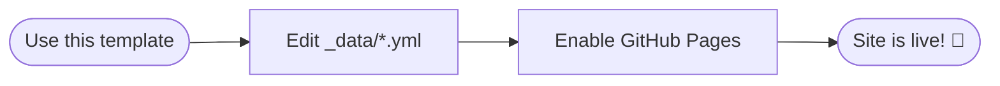
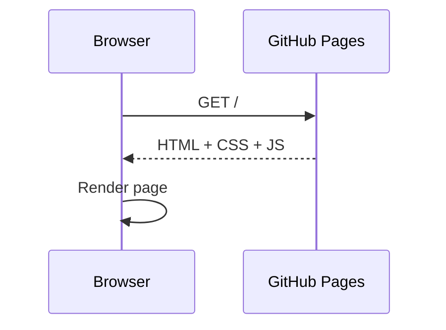

Welcome aboard. This short post is a **feature tour** so you can see what Cirrus looks like before writing anything of your own. For a complete walkthrough, read the three-part **Mastering Cirrus for Jekyll** series linked from the `/articles/` page.

## Getting started

1. Click **"Use this template"** on [the repository](https://github.com/Arnaud-Ferriere/Cirrus-for-Jekyll) → **"Create a new repository"**
2. Enable GitHub Pages in **Settings → Pages** (deploy from `main`, root folder)
3. Edit `_config.yml` with your site title, URL and language
4. Fill in `_data/author.yml` with your name, role, LinkedIn, GitHub, email
5. Fill in the other `_data/*.yml` files (skills, experiences, certifications, education, languages)
6. Replace `assets/photo.webp` with your own profile picture
7. Delete this post (and the example series in `_posts/` + `_series/`), then write your own

Your site will be live within about a minute of every push — no CI, no terminal.

## Syntax highlighting

Code blocks use [Rouge](https://rouge.jneen.net/) out of the box. The language identifier after the opening triple-backticks drives the colors. Hover any block to reveal a **copy-to-clipboard button**.

```powershell
# List automatic services that are stopped and try to restart them
$stopped = Get-Service |
  Where-Object { $_.Status -eq 'Stopped' -and $_.StartType -eq 'Automatic' }

foreach ($svc in $stopped) {
    try {
        Start-Service -Name $svc.Name -ErrorAction Stop
        Write-Host "Started: $($svc.DisplayName)" -ForegroundColor Green
    } catch {
        Write-Warning "Failed to start $($svc.DisplayName): $_"
    }
}
```

Inline code also works — for example: `Get-ADUser -Filter * -Properties LastLogonDate`.

## Obsidian callouts

Use the `> [!TYPE]` Obsidian syntax to produce colored callout boxes:

> [!NOTE]
> Neutral context or extra information. Blue accent.

> [!TIP]
> A best practice or shortcut. Green accent.

> [!WARNING]
> Something to be careful about. Yellow accent.

> [!IMPORTANT]
> Key information not to miss. Purple accent.

> [!CAUTION]
> A potential risk or destructive action. Red accent.

## Mermaid diagrams

No front matter flag needed — Mermaid is auto-detected. The library is only fetched on pages that actually contain a `mermaid` code block. Hover any rendered diagram to reveal a fullscreen button with pan and zoom.





## Plain blockquotes

Use a plain `> ` at the start of a line for a classic blockquote (no icon, no color accent):

> "Simplicity is the soul of efficiency."
> — Austin Freeman

## Images

Images in the body support four alignment classes via the kramdown attribute syntax:

```markdown
                ← centered (default)
{: .img-left}   ← float left (45% width)
{: .img-right}  ← float right (45% width)
{: .img-full}   ← full container width
```

Click any inline image in an article to open it in a fullscreen zoom modal.

## Tables

Tables get a card-style look with rounded corners, alternating row backgrounds, and hover highlighting. Wide tables scroll horizontally on mobile inside an accessible region.

| Feature | How to enable | Default |
|---|---|---|
| Dark mode | Navbar toggle or OS preference | Auto |
| Mermaid | Just write a `mermaid` code block | Auto-detected |
| "Updated" date | `last_modified_at: YYYY-MM-DD` | Hidden |
| AI disclaimer | `placeholder: true` in front matter | Hidden |
| Difficulty badge | `difficulty: beginner` (or intermediate/advanced/expert) | Hidden |

## Difficulty badges

Add `difficulty: beginner` (or `intermediate`, `advanced`, `expert`) to a post and you get a weather-themed badge:

- ☀️ **Beginner** — no prior knowledge required
- ☁️ **Intermediate** — assumes familiarity with the tool
- 🌧️ **Advanced** — for readers comfortable with the topic
- 🌪️ **Expert** — deep dive, niche specialists

The example series "Mastering Cirrus for Jekyll" uses all four — see `/articles/` for the cards.

## Article series

Group related posts into a series. Each post in a series gets a **series block** at the bottom listing every part, a 4-level SEO breadcrumb, and a card on the `/articles/` "By series" view. There is also a dedicated page at `/series/<slug>/`. See **Part 3** of the example series for the full how-to.

## Next steps

- Read the **Mastering Cirrus for Jekyll** series (linked from `/articles/`)
- Check the `Templates/post-template.md` file for a ready-to-use article skeleton with all front matter fields documented
- Customize colors and fonts in `custom.css` at the repo root

Happy writing! 🚀
