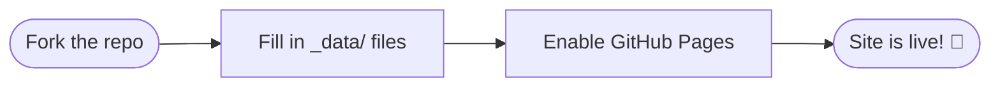
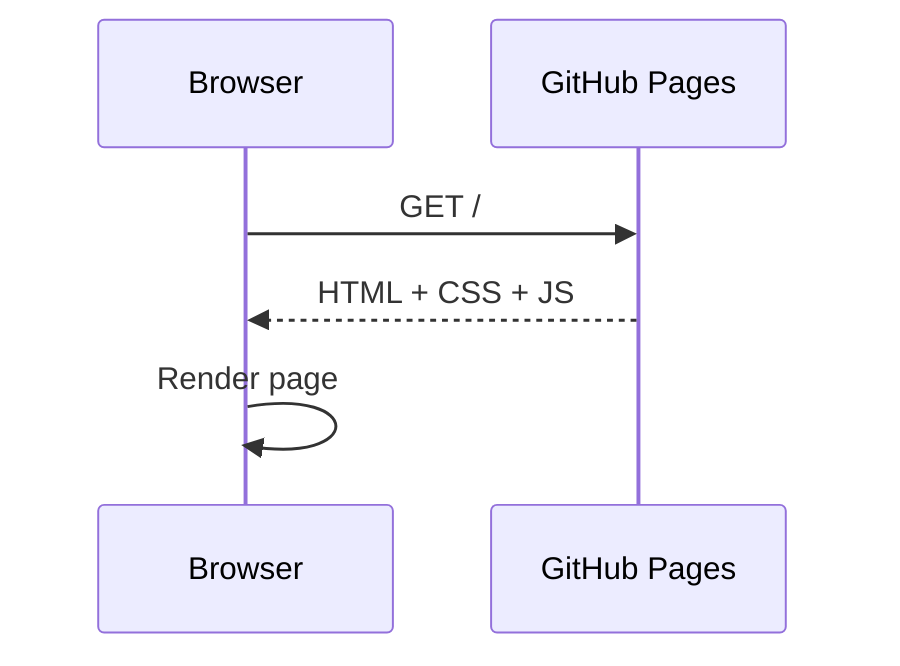

This post demonstrates the main features available in Cirrus for Jekyll. Feel free to replace it with your first real article!

## Getting started

1. Edit `_config.yml` with your site title, URL and description.
2. Fill in `_data/author.yml` with your personal info.
3. Fill in the other `_data/*.yml` files with your skills, experience, certifications, etc.
4. Replace `assets/photo.webp` with your own profile picture.
5. Delete this post and write your first real article!

---

## Syntax highlighting

Articles support syntax highlighting out of the box via Rouge:

```powershell
# List all stopped services and attempt to restart them
$stopped = Get-Service | Where-Object { $_.Status -eq 'Stopped' -and $_.StartType -eq 'Automatic' }

foreach ($svc in $stopped) {
    try {
        Start-Service -Name $svc.Name -ErrorAction Stop
        Write-Host "Started: $($svc.DisplayName)" -ForegroundColor Green
    } catch {
        Write-Warning "Failed to start $($svc.DisplayName): $_"
    }
}
```

Inline code also works: `Get-ADUser -Filter * -Properties LastLogonDate`.

---

## Callouts

Use Obsidian-style callouts to highlight important information:

> [!NOTE]
> This is a note — useful context or extra information.

> [!TIP]
> This is a tip — a best practice or shortcut worth knowing.

> [!WARNING]
> This is a warning — something to be careful about.

> [!IMPORTANT]
> This is important — key information not to miss.

> [!CAUTION]
> This is a caution — a potential risk or dangerous action.

---

## Mermaid diagrams

Add `mermaid: true` to your front matter, then use fenced ` ```mermaid ` blocks.
Hover over the diagram to reveal the fullscreen pan/zoom button.





---

## Blockquotes

> "Simplicity is the soul of efficiency."
> — Austin Freeman

---

## Images

Images can be aligned with CSS classes:

```markdown
               ← centered (default)
{: .img-left}  ← float left
{: .img-right} ← float right
{: .img-full}  ← full width
```

Click any image in an article to open it fullscreen.

---

## Tables

| Feature | How to use | Default |
|---|---|---|
| Dark mode | Toggle in navbar or follows OS | Auto |
| Mermaid | `mermaid: true` in front matter | Off |
| Last modified | `last_modified_at: YYYY-MM-DD` | Hidden |
| AI disclaimer | `placeholder: true` in front matter | Hidden |

---

Happy writing! 🚀
