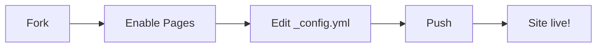

This is the first article in the **Mastering Cirrus for Jekyll** series. It demonstrates the `difficulty: beginner` badge and `series`/`series_part` front matter fields.

## What you'll learn

- How to fork the template
- How to enable GitHub Pages
- How to write your first post

> [!NOTE]
> This is a placeholder article. The `placeholder: true` flag in the front matter triggers the AI-generated disclaimer banner at the top of the post.

## A simple flowchart

## Next step

Continue with **Part 2** to learn how to customize the look and feel.
