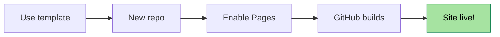

Welcome to **Part 1** of the *Mastering Cirrus for Jekyll* series. In this first article, we go from zero to a live site on GitHub Pages, with nothing installed on your machine — no Ruby, no terminal, no CI pipeline.

This article uses the `beginner` difficulty badge (☀️) and is `series_part: 1` of the series. You can see the series block listed at the bottom of the article.

## Why this template

Cirrus is a **GitHub template**, not a starter repo. That means:

- No forking — you create a **fresh repository** that belongs to you, with no ties to the upstream
- No license quirks — the template is under CC BY 4.0, and your site is yours
- Full GitHub Pages compatibility — native build, no GitHub Actions needed
- Zero runtime dependencies on external CDNs (everything is self-hosted)

## Step 1 — Create your repository from the template

1. Open the repository on GitHub: [Cirrus for Jekyll](https://github.com/Arnaud-Ferriere/Cirrus-for-Jekyll).
2. Click the green **"Use this template"** button at the top right, then **"Create a new repository"**.
3. Name your repo — typically `your-username.github.io` for a root-domain site, or any name if you plan to host at a subpath.
4. Set it to **public** (GitHub Pages free tier requires public repos).
5. Click **"Create repository"**.

> [!NOTE]
> "Use this template" and "Fork" look similar but behave very differently. A fork stays linked to the upstream and shares its history. A template creates an independent repo with a single initial commit — perfect for starting a personal project.

## Step 2 — Enable GitHub Pages

1. Go to your new repo's **Settings → Pages**.
2. Under **Source**, select **Deploy from a branch**.
3. Set the branch to **main** and the folder to **`/` (root)**.
4. Click **Save**.

Within about a minute, GitHub will build the site and give you a URL at the top of the Pages settings. That URL is now live. Seriously — go check.



## Step 3 — Configure the basics

Edit **`_config.yml`** directly from the GitHub web editor (no git required):

```yaml
title: Jane Doe
home_title: "Hello, I am Jane"
home_tagline: "Cloud engineer, writer, occasional gardener."
url: "https://jane-doe.github.io"
baseurl: ""                      # "/your-repo" if you did not name it <user>.github.io
description: "Personal site of Jane Doe, cloud engineer."
lang: en
```

Commit the change. GitHub will rebuild your site automatically — give it ~30 seconds.

## Step 4 — Add your personal info

Edit **`_data/author.yml`**:

```yaml
name: Jane Doe
role: Cloud Engineer
linkedin: https://www.linkedin.com/in/jane-doe/
github: https://github.com/jane-doe
email_user: jane
email_domain: example.com
bio: >-
  Passionate about distributed systems, clear writing, and a good espresso.
```

> [!TIP]
> The email is **never** written as `jane@example.com` in the HTML. The `shared.js` helper reassembles it client-side from `data-email-*` attributes. Scrapers see nothing parseable.

## Step 5 — Write your first post

Create a file named `_posts/YYYY-MM-DD-my-first-post.md` (the date prefix is mandatory) using GitHub's web editor. Paste this:

```markdown
---
layout: post
title: "Hello world"
date: 2025-01-15
excerpt: "My first post on my shiny new Cirrus-powered site."
tags: [personal, hello]
---

I finally have a blog. This is great.
```

Commit. Refresh your site. You should see the card appear on the home page, and the article is reachable at `/articles/my-first-post/`.

## What you just got for free

Without writing any HTML or CSS:

- A responsive **home page** with article cards, tag cloud, and client-side search
- A **CV/About page** wired to YAML files (skills, experience, certifications)
- A **dark mode** toggle that respects the OS preference
- An **RSS feed** at `/feed.xml`
- A **sitemap** at `/sitemap.xml` (SEO)
- Automatic **Open Graph** and **Twitter Card** meta tags on every article

## Up next

**Part 2** walks through how to make the site *feel* like yours: overriding colors and fonts via `custom.css`, swapping the decorative wave, and understanding the SCSS architecture if you want to go deeper.
