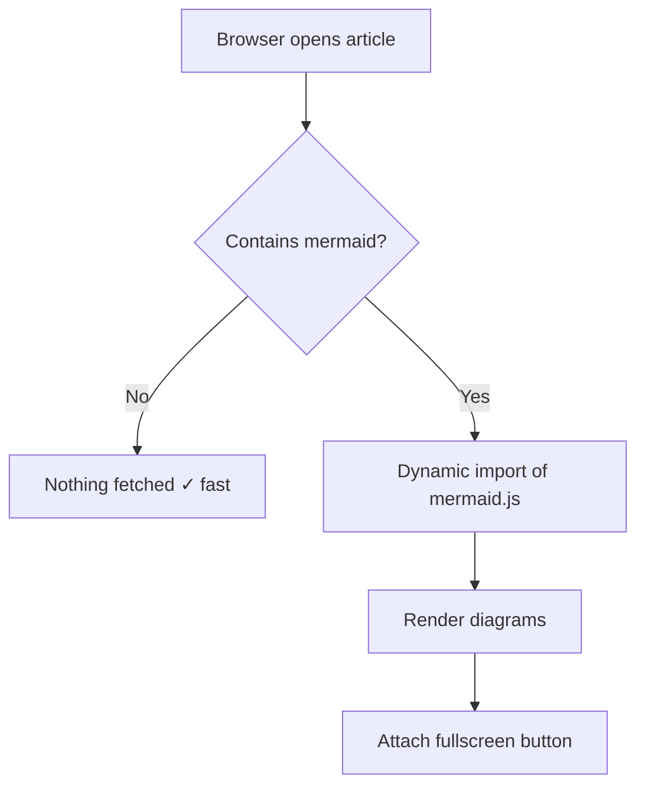
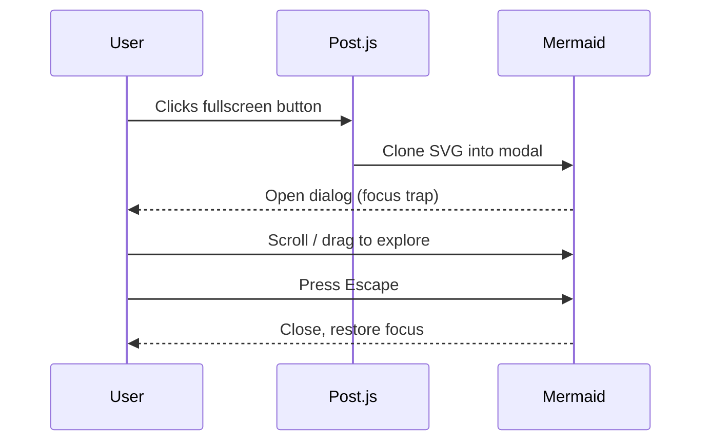

This article wraps up the series and doubles as a **feature reference**. It uses the `advanced` difficulty badge (🌧️) and is **self-referential**: you are reading Part 3 of a series, and this section of the site explains how series work.

Scroll down to see the **series block** auto-generated under the content — it lists Parts 1, 2, 3 with this article highlighted.

## Article series

A series is made of two pieces.

### The series stub

A file in the `_series/` collection declares the series metadata:

```yaml
---
series_name: "mastering-cirrus"
title: "Mastering Cirrus for Jekyll"
description: "A 3-part tour of the Cirrus template."
expected_count: 3
---
```

The `series_name` is the identifier posts will link to. `expected_count` is optional — if set and greater than the number of published posts, the series card shows a progress counter like `2/3 articles`.

For series you are still drafting, put the stub in `_series_drafts/` instead of `_series/`. Jekyll only builds drafts locally with `jekyll serve --drafts`, so they never leak to production.

### The posts

Each post in the series sets two fields in its front matter:

```yaml
series: "mastering-cirrus"
series_part: 3
```

That is all. The template does the rest:

1. **Series block** at the bottom of the post, listing every part with the current one highlighted
2. **Dedicated series page** at `/series/mastering-cirrus/` listing all articles in order
3. **Card on `/articles/`** in the "By series" view (visible only if at least one series has published posts)
4. **4-level breadcrumb** in the JSON-LD (Home > Articles > Series > Post) for richer SEO
5. **`ItemList` JSON-LD** on the series page so search engines understand the reading order

## Mermaid diagrams

Mermaid is **auto-detected**. No front matter flag. The library is only fetched when the page actually contains a `mermaid` code block, so pages without diagrams stay fast.

### A flowchart



### A sequence diagram



Hover any rendered diagram to reveal a **fullscreen button**. The modal supports mouse wheel zoom, click-and-drag pan, touch pinch-zoom, `role="dialog"`, keyboard focus trap, Escape-to-close, and focus restoration.

## Obsidian-style callouts

All five Obsidian callouts are recognized:

> [!NOTE]
> Generic information. Blue accent. Use it for contextual side-notes that are neither warnings nor tips.

> [!TIP]
> A helpful tip or best practice. Green accent. Tell the reader about the shortcut you wish someone had told you.

> [!WARNING]
> Something to be careful about. Yellow accent. The reader can still proceed but should double-check.

> [!IMPORTANT]
> Critical information. Purple accent. Miss this and the rest of the article will not make sense.

> [!CAUTION]
> Real danger. Red accent. Reserve for genuinely destructive or irreversible actions.

Syntax is exactly the Obsidian one, so your notes stay portable:

```markdown
> [!TIP]
> A helpful tip.
```

## Code blocks with copy button

Every code block gets a **copy-to-clipboard button** in its top-right corner, visible on hover or keyboard focus. Try it on this snippet:

```powershell
# Find all Azure AD users with a specific license
$skuId = '6fd2c87f-b296-42f0-b197-1e91e994b900'  # Example: E3
Get-AzureADUser -All $true |
  Where-Object { $_.AssignedLicenses.SkuId -contains $skuId } |
  Select-Object UserPrincipalName, DisplayName, Department |
  Export-Csv -Path .\licensed-users.csv -NoTypeInformation -Encoding UTF8
```

The button shows a confirmation state ("Copied!") for 2 seconds after a successful copy, and falls back gracefully if the Clipboard API is unavailable.

## The floating TOC pill

When an article has **3 or more H2 sections**, a floating pill appears in the bottom-left corner once you scroll past the inline TOC. It displays the current section (`N/total`) and its title.

- **Click the pill** to open a drawer with the full outline
- **Keyboard:** Tab moves focus to the pill, Enter opens the drawer, Tab is trapped inside, Escape closes
- **Section tracking** uses an `IntersectionObserver` so there is no scroll handler firing 60 times per second
- **Motion-reduced** users get no animation (respects `prefers-reduced-motion`)

This article has 9 H2 headings, so you should see the pill appear as you read. If the inline TOC above is visible in your viewport, the pill hides automatically.

## Smart links

Bare URLs in the article source are auto-linked at render time. Write:

```markdown
Visit https://jekyllrb.com for the docs.
```

and it becomes a clickable link. **External links** also get:

- `target="_blank"` and `rel="noopener noreferrer"` for security
- A small external-link icon after the text
- A screen-reader-only "(opens in a new window)" label

Visit https://schema.org to see it in action.

## Keyboard shortcut

Press **`/`** anywhere on the home page to focus the search input. The handler is in `shared.js` and skips the shortcut when you are already typing in an input or `contenteditable` element — so it will not interrupt your writing.

## Accessibility recap

Everything you see in Cirrus ships with a11y baked in:

- Skip-to-content link (Tab once from page top)
- `focus-visible` outlines on every interactive element
- `prefers-reduced-motion` global rule disables animations
- Tables wrapped in `role="region"` with an `aria-label`
- External links get the sr-only "opens in a new window"
- Difficulty badges have a full `aria-label="Difficulty: Advanced"`
- Dark-mode auto + manual toggle persisted safely (try/catch around `localStorage`)

## That is a wrap

You just finished the series! The block immediately below this paragraph is the auto-generated series navigation. Click any part to jump around, or head to **/series/mastering-cirrus/** for the dedicated series page.

Thanks for reading, and happy publishing.
