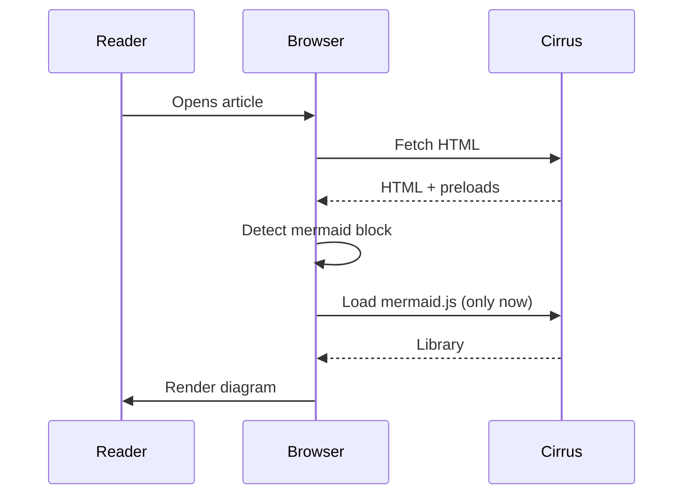

Welcome to **Part 3** of the series — this article uses the `advanced` difficulty badge and demonstrates the **self-referential series** feature: scroll to the end and you'll see this very article listed as part 3.

## Article series

A series is powered by two things:

1. A **stub file** in `_series/<slug>.md` that declares the series metadata (title, description, expected count)
2. The `series:` + `series_part:` fields on each post in the series

Each article in the series automatically gets:

- A **series block** at the bottom listing all parts, with the current one highlighted
- A **4-level SEO breadcrumb** (Home > Articles > Series > Post)
- A card on the `/articles/` "By series" view
- A dedicated page at `/series/<slug>/`

## Mermaid diagrams

Mermaid is **auto-detected** — no front matter flag needed. Just write your diagram:



The library is only downloaded on pages that contain a `mermaid` code block — pages without diagrams stay fast.

## Floating TOC pill

Scroll down this article and watch the bottom-left corner: once you pass the inline TOC, a **floating pill** appears showing the current section (N/total). Click it to open a drawer with the full outline.

## Callouts

Cirrus supports all five Obsidian-style callouts:

> [!NOTE]
> Generic information — neutral blue accent.

> [!TIP]
> Best practices and helpful hints — green accent.

> [!WARNING]
> Something to be careful about — yellow accent.

> [!IMPORTANT]
> Critical information — purple accent.

> [!CAUTION]
> Actual danger — red accent.

## Code blocks with copy button

Every code block gets a **copy-to-clipboard button** in its top-right corner (visible on hover). Try it on this snippet:

```powershell
# Get all Azure AD users with a specific license
Get-AzureADUser -All $true |
  Where-Object { $_.AssignedLicenses.SkuId -contains 'YOUR_SKU_ID' } |
  Select-Object UserPrincipalName, DisplayName, Department
```

## That's a wrap

You've reached the end of the series! The block below this text shows all three parts with the current one highlighted — that's the auto-generated series navigation.
