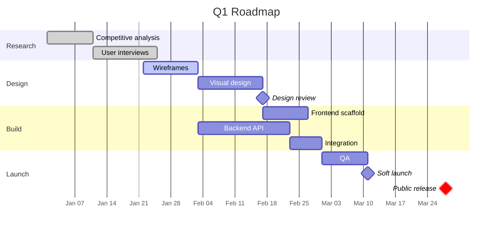

This is a **standalone example** (no series) that exercises most of Cirrus's features at once. Use it as a living reference: pick a feature below, look at the Markdown source on GitHub, and copy what you need.

The front matter sets:

- `difficulty: expert` → displays the 🌪️ expert badge
- `last_modified_at: 2024-04-05` → shows an "Updated" date next to the publication date in the header
- `placeholder: true` → AI-generated disclaimer banner

## Big responsive tables

Wide tables are automatically wrapped by `post.js` in a `<div class="table-wrapper"><div class="table-scroll" role="region" aria-label="Scrollable table">`. On mobile the inner div scrolls horizontally without breaking the rounded outer corners; on desktop the table just fills the width.

| Command | Description | Works on | Notes |
|---|---|---|---|
| `git clone <url>` | Clone a repository | Universal | HTTPS or SSH |
| `bundle install` | Install Ruby gems from `Gemfile` | Ruby | Creates `Gemfile.lock` |
| `bundle exec jekyll serve` | Start the local dev server | Ruby | Watches and rebuilds |
| `bundle exec jekyll serve --drafts` | Also render `_drafts/` and `_series_drafts/` | Ruby | Never use in production |
| `bundle exec jekyll build` | One-shot build into `_site/` | Ruby | Used by GitHub Pages |
| `gh repo create` | Create a GitHub repo from the CLI | GitHub CLI | Needs `gh auth login` |
| `gh release create v1.0.0` | Publish a GitHub release | GitHub CLI | Tag and release in one command |

Try scrolling the table horizontally on a narrow screen — the scroll region is keyboard-focusable (Tab) and announced to screen readers.

## Gantt chart

A project timeline rendered entirely client-side by Mermaid:



Because Mermaid is auto-detected, this page pulls the library on load. Pages without `mermaid` blocks do **not** incur this cost.

## Side-by-side images

Two images placed next to each other by adding `{: .img-left}` and `{: .img-right}` to consecutive Markdown images. On narrow screens they stack vertically and take the full width.

{: .img-left}
{: .img-right}

Body text flows naturally between the two floated images on wide viewports. Below 576px they un-float and become full-width to stay readable. Click either image to open it in the zoom modal.

## Full-width image

Add `{: .img-full}` to stretch an image to the full container width:

{: .img-full}

## Inline code and smart auto-linking

Inline code gets a subtle tinted background: the command `ls -la` stays readable in both light and dark modes, with proper contrast.

Bare URLs in prose are auto-linked at render time. Visit https://jekyllrb.com/docs/ or https://schema.org for more context — no Markdown brackets needed. External links automatically receive `target="_blank"`, `rel="noopener noreferrer"`, an external-link icon, and a screen-reader-only "(opens in a new window)" label.

## Nested lists and emphasis

1. **Top-level ordered item** — bold works inline
   - *Nested bullet* with emphasis
   - Another nested bullet with `inline code`
2. Top-level ordered item with a [regular link](https://github.com/Arnaud-Ferriere/Cirrus-for-Jekyll)
   1. Nested ordered
   2. Still nested
3. Third item — see how spacing stays tight

## Blockquotes (plain, no callout)

> Not every quote needs a callout header. A plain `> ` at the start of a line produces a classic blockquote — styled with a left border and muted text, no icon.
>
> You can have multiple paragraphs in a blockquote by continuing with `>` on each line.

## Callouts refresher

> [!NOTE]
> Covered in depth in Part 3 — this example simply confirms they render here too.

> [!CAUTION]
> Expert-level content often involves destructive commands. **Always test in a non-production environment first.**

## A longer code block

```python
"""
cirrus-to-pelican: hypothetical migration script from Cirrus posts to Pelican.
Purely illustrative — do not run this against real content.
"""
from pathlib import Path
import yaml
import sys


def parse_front_matter(text: str) -> tuple[dict, str]:
    """Split a Markdown file into (front_matter, body)."""
    if not text.startswith("---"):
        raise ValueError("Missing front matter")
    _, fm, body = text.split("---", 2)
    return yaml.safe_load(fm), body.lstrip("\n")


def convert(post_path: Path) -> str:
    fm, body = parse_front_matter(post_path.read_text(encoding="utf-8"))
    pelican_header = "\n".join([
        f"Title: {fm['title']}",
        f"Date: {fm['date']}",
        f"Tags: {', '.join(fm.get('tags', []))}",
        f"Slug: {post_path.stem}",
        "",
    ])
    return pelican_header + body


if __name__ == "__main__":
    for path in Path("_posts").glob("*.md"):
        out = convert(path)
        print(f"--- {path} ---")
        print(out[:200], "...\n")
```

The **copy button** in the top-right of the block works on all code blocks, regardless of language.

## Series vs standalone

This article is **not** part of a series — notice the absence of a series block above the tags. For comparison, the three *Mastering Cirrus* articles link to each other through `series: "mastering-cirrus"` in their front matter. Both forms coexist peacefully.

## Wrapping up

If you reached this point, you have seen essentially every content feature Cirrus offers. Delete this file whenever you want — or keep it around as an in-repo cheat sheet.
