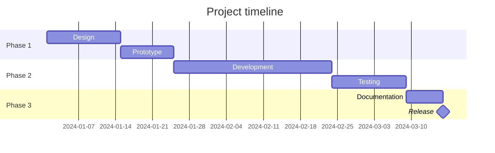

This article shows the **expert** difficulty badge and demonstrates features that don't fit in a series.

## Table with scroll region

Large tables are automatically wrapped in a scrollable region with `role="region"` and `aria-label` for screen readers:

| Command | Description | Platform | Notes |
|---|---|---|---|
| `git clone` | Clone a repository | Universal | Supports SSH and HTTPS |
| `jekyll serve` | Start local dev server | Ruby | Watches files by default |
| `bundle install` | Install gem dependencies | Ruby | Uses the Gemfile |
| `gh release create` | Publish a GitHub release | GitHub CLI | Requires `gh auth login` |
| `npm install` | Install npm packages | Node.js | Not needed for Cirrus |

## Gantt chart via Mermaid

## Side-by-side images

Two images aligned left and right:

{: .img-left}
{: .img-right}

Text flows between them on wide screens, and they stack vertically on mobile.

## Inline code and smart links

Visit https://jekyllrb.com for the Jekyll docs — the URL above was **not** wrapped in Markdown brackets. Cirrus auto-linked it for you, and the external-link icon plus screen-reader text were added automatically.

Inline `code` in prose stays readable in both themes, with proper contrast and a subtle background tint.

## Summary

This article ticks a lot of boxes at once — use it as a reference when building your own content.
